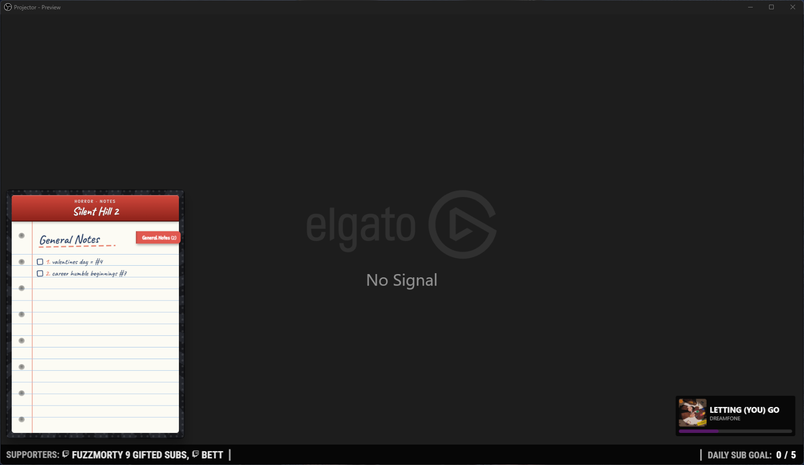
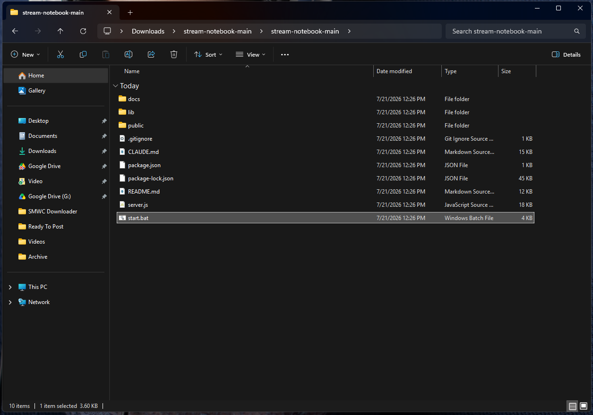
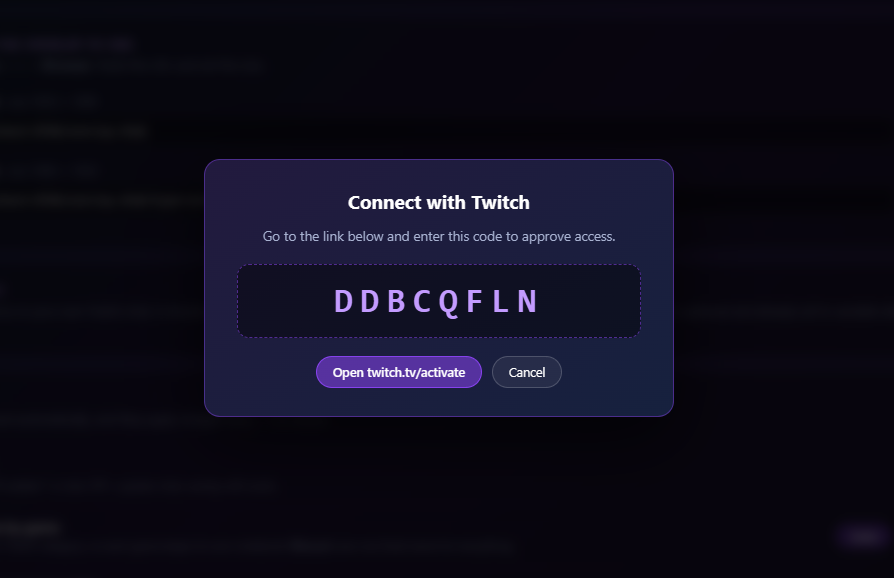
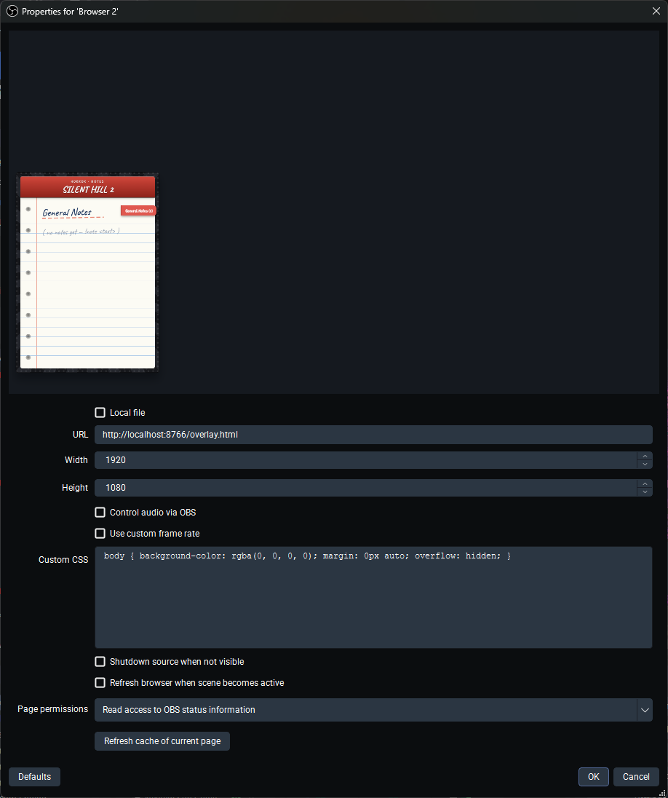

# 📓 Stream Notebook

A handwritten-looking notebook that lives on your stream and fills itself from chat.

Your mods type `!note dont forget the blue key`, and it appears on screen in a
composition notebook — numbered, checkable, and automatically filed under whatever
game you're playing. Switch games and you get a fresh notebook; switch back and
your old notes are still there.

Runs on your own PC. Nothing to sign up for, no monthly anything.

  

<!-- SCREENSHOT: the notebook overlaid on real gameplay. See docs/README-images.md -->


---

## 📥 Get it

<h3 align="center">
  <a href="https://github.com/iamtheratio/stream-notebook/archive/refs/heads/main.zip">⬇ Download Stream Notebook</a>
</h3>

<p align="center"><sub>Downloads a ZIP. Unzip it, double-click <code>start.bat</code>, and you're going.<br>
Full steps below — the whole thing takes about five minutes.</sub></p>

---

## What you need

- A **Windows PC**
- **OBS** (or Streamlabs — anything that can add a "browser source")
- Your **Twitch account**
- **[Node.js](https://nodejs.org)** — this is the only thing you might not have.
  Click the big green **LTS** download button on that page, run the installer, and
  click Next until it finishes. You never have to open it or look at it again.

That's everything. You do **not** need Streamer.bot, Mix It Up, a second bot
account, an API key, or anything you have to pay for or sign up to.

<sub>On a Mac or Linux? It works — open a terminal in the folder and run
`npm install && npm start` instead of double-clicking `start.bat`.</sub>

---

## Setup

### Step 1 — Unzip it and double-click `start.bat`

Unzip the download somewhere you'll find it again — `C:\StreamNotebook` is a good
spot. **Don't run it from inside the ZIP**, Windows won't let it work properly.

Open the folder and **double-click `start.bat`**.

<!-- SCREENSHOT: the unzipped folder in Explorer, start.bat highlighted -->


A black window opens with white text. **That's normal — that's the notebook
running.** Leave it open the whole time you stream; closing it turns the notebook
off.

The very first time, it spends a minute or two setting itself up. After that it
starts in a couple of seconds.

Your web browser then opens by itself to the dashboard. If it doesn't, the black
window prints the address — type that into your browser. It's usually
**localhost:8765**.

> **Windows may warn you about the file.** If you see "Windows protected your PC",
> click **More info** → **Run anyway**. That warning appears for anything
> downloaded from the internet that hasn't paid for a signing certificate.

### Step 2 — Click "Connect with Twitch"

On the dashboard, click the purple **Connect with Twitch** button.

You'll get a **6-character code**. Click the link next to it, sign in to Twitch if
it asks, type the code in, and approve.

<!-- SCREENSHOT: dashboard showing the 6-character device code -->


Go back to the dashboard — it turns **green** on its own within a few seconds. You
don't need to refresh or click anything else.

> **There's nothing to copy, paste, or keep safe here.** No tokens, no passwords, no
> developer account.
>
> **What it's allowed to do:** read your chat, post short confirmations like
> "Note #3 added", and see which game your channel is set to. That's the complete
> list. It cannot change your stream title, start ads, see your email, or read your
> DMs.

### Step 3 — Add it to OBS

In OBS, look at the **Sources** box at the bottom. Click the **+** → choose
**Browser** → give it a name like `Stream Notebook` → **OK**.

A settings window opens. Fill it in like this:

| Field | What to put |
|---|---|
| **URL** | Click **Copy** on the dashboard, then paste it here |
| **Width** | `1920` |
| **Height** | `1080` |

Leave everything else alone.

**Also stream vertically (TikTok, Shorts)?** Add a **second** browser source on
your vertical scene, and use the dashboard's **vertical** Copy button:

| Field | What to put |
|---|---|
| **URL** | The **vertical** URL from the dashboard |
| **Width** | `1080` |
| **Height** | `1920` |

Both can run at the same time, and each has its own position and size in the
dashboard.



<sub>Always copy the URL from your own dashboard rather than typing one from this
page — the number in it can differ from machine to machine.</sub>

Click **OK**. Don't worry that nothing appears yet — **the notebook is invisible
until there's a note to show.** That's on purpose, so it isn't sitting on your
screen empty.

<sub>Rather not type that URL? The dashboard has a **Copy** button that puts it on
your clipboard — then just click in the URL box in OBS and press Ctrl+V.</sub>

### Step 4 — Test it

Go to your own Twitch chat and type:

```
!note this is my first note
```

The notebook should slide into the **bottom-left** of your OBS preview within a
second, show your note, then tuck away again after about 20 seconds.

**Seeing it? You're completely set up.** Drag the source around in OBS if you want
it somewhere other than the bottom-left.

**Nothing happened?** Jump to [Troubleshooting](#troubleshooting) — it's almost
always one of two easy things.

---

## Commands

By default **you and your moderators** can use everything. **Anyone** can use the
view-only commands. `!note` and `!notes` are interchangeable.

### Adding and editing

| Command | What it does |
|---|---|
| `!note <text>` | Add a note |
| `!note 3 <text>` | Replace the text of note 3 |
| `!note 3 done` | Tick note 3 off ✔ |
| `!note 3 undone` | Un-tick it |
| `!note 3 scratch` | Cross it out ✗ |
| `!note 3 unscratch` | Un-cross it |
| `!note 3 delete` | Delete it (remaining notes renumber) |

### Tidying up

| Command | What it does |
|---|---|
| `!note archive` | Move every ticked note to a "Completed Notes" page |
| `!note 3 archive` | Move just note 3 there, marking it done |
| `!note 3 unarchive` | Bring note 3 back to the active list |
| `!note clear all` | Wipe the current page 🔥 |

### Pages and chapters

| Command | What it does |
|---|---|
| `!note chapter <name>` | Switch to a named chapter, creating it if new |
| `!note page next` / `prev` | Flip the notebook page |
| `!note page 2` | Jump to page 2 |

Chapters are tabs within the current game — handy for `!note chapter Boss Fight`
versus your general run notes.

### Showing and hiding

| Command | Who | What it does |
|---|---|---|
| `!note show` | anyone | Pin the notebook open |
| `!note show 3` | anyone | Pin it open, highlighting note 3 |
| `!note hide` | anyone | Unpin it |
| `!note list` | anyone | Print the current notes into chat |
| `!note on` / `off` | mods | Master switch for the whole system |
| `!note help` | anyone | Print the command list into chat |

Viewers get a cooldown (10s by default) on the public commands so nobody can
spam-flicker your overlay. You and your mods are exempt.

---

## The dashboard

The page that opens when you start the notebook — usually
**http://localhost:8765**. Everything is configured here. There are no config
files to edit.

- **Status** — Twitch, chat, current game, and whether notes are saving
- **Options** — chat replies, notebook position and size, who can add notes, cooldown
- **Overlay Controls** — show/hide/on/off buttons, if you'd rather click than type
- **Activity** — a live log, useful when something isn't working

### Manage Notes

The **Manage Notes** link at the top of the dashboard — a full editor for every
note you've ever taken, across every game. Add, edit, reorder, rename chapters, delete old games.
Edits to the game you're currently playing show up on stream instantly.

Useful for prepping a run in advance, or cleaning up after a long stream.

**Showing an older game on stream.** Click the 📌 next to any game to put its
notes on screen, even if you're playing something else. The notebook stays there
until you unpin it — it won't jump back when your Twitch category changes. The bar
at the top says **PINNED** while this is on, with an **Unpin** link.

Handy for pulling up last week's boss notes, or prepping in Just Chatting.

---

## Options explained

**Notebook position & size** — which corner it sits in, and how big it is.

Your **normal** stream and your **vertical** stream get their own settings, so you
can run both at once and have each look right. Changes appear straight away — you
don't need to touch OBS.

Sizes go Small → Huge. Turn it up on a big (1440p/4K) screen or a vertical one,
where the normal size looks small. Text stays sharp at every size.

**Stop the notebook** — turns it off completely. Your notes are saved. Double-click
`start.bat` to bring it back.

**Reply in chat** — posts short confirmations like `📓 Note #3 added.` Turn it off
for a quieter chat; the overlay still updates either way.

**Organise notes by game**
- **Auto** (default) — follows your Twitch category, so every game keeps a separate
  notebook. Checked once a minute.
- **Manual** — files everything under one name you choose. Good for Just Chatting
  or if you don't change categories.

**Who can use notes** — three switches. You always have full control.

| Switch | Default | What it gives them |
|---|---|---|
| Moderators can manage notes | **On** | Everything — add, edit, delete, clear |
| VIPs can add notes | Off | Adding only |
| Subscribers can add notes | Off | Adding only |

Turn moderators **off** if you'd rather be the only one who can change your notes.
Anyone in chat can always use `!note show`, `hide` and `list`.

**Viewer cooldown** — seconds a regular viewer waits between `show`/`hide`/`list`.
Set to 0 to disable.

---

## Troubleshooting

**Nothing appears in OBS**
Right-click the browser source → **Refresh**. Check the console window is still
open and the dashboard shows Twitch as connected.

**The notebook is blurry**
Don't resize the source by dragging its corners in OBS — that stretches the picture
and blurs the text. Set the browser source to the size in the table above, then use
**Notebook size** in the dashboard instead. That redraws it properly, so it stays
sharp.

**The notebook is too small / in the wrong place**
Dashboard → **Options** → **Notebook position & size**. Your normal and vertical
overlays have separate settings.

**The notebook is stuck on the wrong game**
It's pinned. The bar at the top of the Manage Notes page says **PINNED** — click
**Unpin** and it'll follow your Twitch category again.

**Commands do nothing**
Check the dashboard's **Activity** log. If chat shows red, reconnect Twitch. Also
make sure you're typing in the chat of the account you connected.

**"Twitch rejected the login"**
Your token expired or access was revoked. Click **Disconnect**, then
**Connect with Twitch** again.

**The address isn't localhost:8765**
If something else on your PC was already using 8765, Stream Notebook quietly moves
to the next free port and tells you which one in its window. Use the address it
prints, and copy the overlay URL from the dashboard so OBS matches.

**Notes aren't saving**
The dashboard will say so. Usually means `better-sqlite3` failed to install —
delete the `node_modules` folder and run `start.bat` again.

---

## Where your data lives

Everything user-specific is in `data/` (gitignored, never committed):

| File | Contents |
|---|---|
| `notes.db` | Every note, chapter and game — SQLite, back it up if you care about it |
| `settings.json` | Your options and Twitch token |
| `notes-state.json` | Whether the overlay is currently on/visible |

To move to a new PC, copy the `data/` folder across.

---

## How it works

```
Twitch chat ──► TwitchChat (IRC) ──► NotesService ──► SQLite (data/notes.db)
                                          │
                                          └──► WebSocket ──► overlay in OBS
                                                         └──► notes manager page
```

The overlay never holds authoritative state — the server sends a full render on
every change and the overlay diffs it to drive the animations. A dropped message
can't desync the display; it just resolves on the next update.

Adapted from the notes service in a larger multi-service streaming server.
The notebook module (`public/notebook-overlay.js`) is self-contained and can be
dropped into any existing overlay page: include it, call `NotesOverlay.attach(ws)`
on connect, and route `note:*` events to `NotesOverlay.handle(event, data)`.

---

## License

MIT — do what you like with it.
